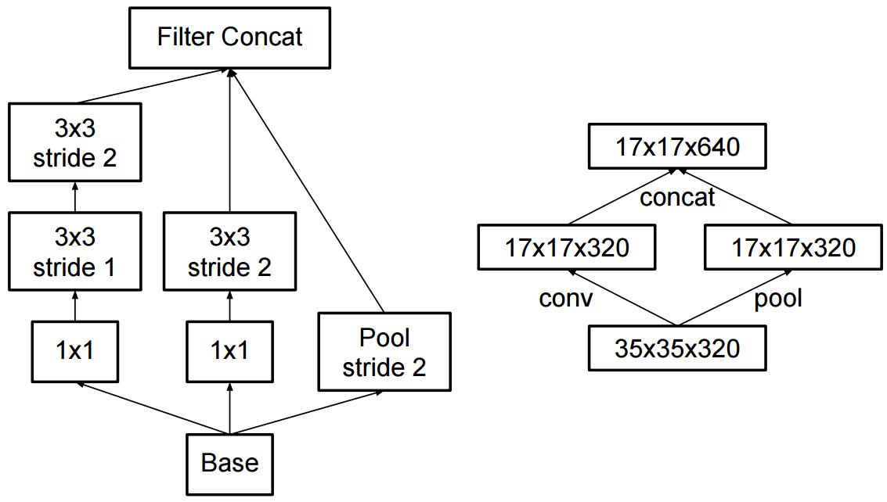
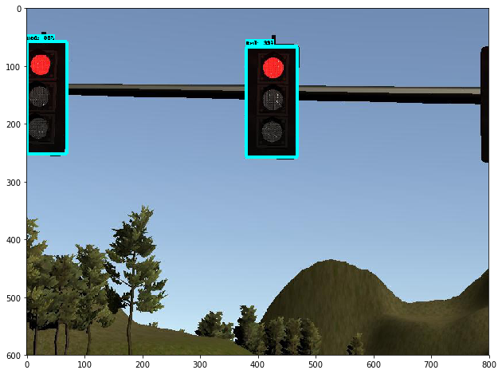
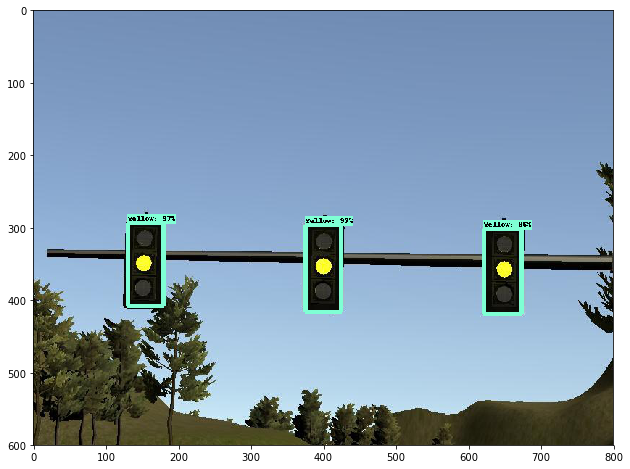
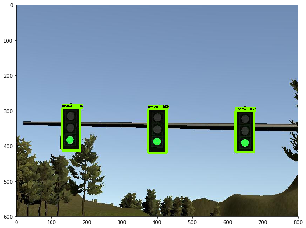
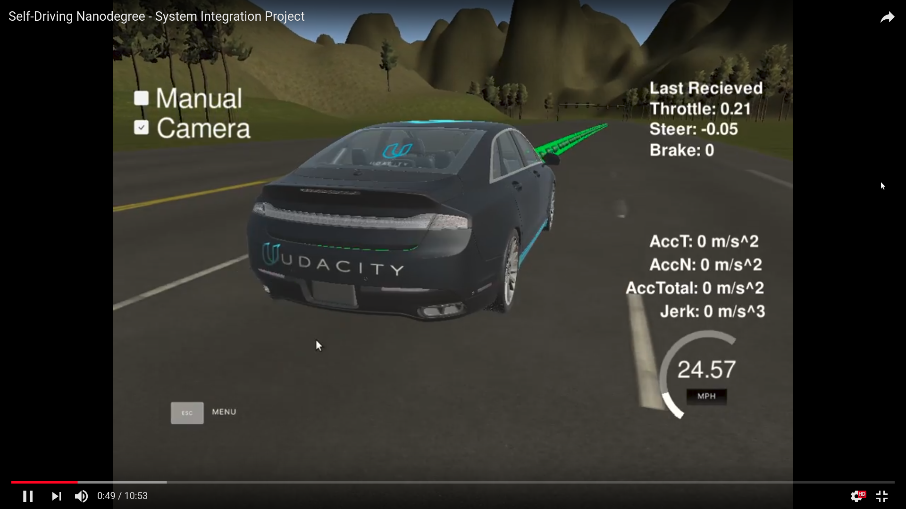

# Self-Driving Car Engineer Nanodegree

## Capstone Project - System Integration

As the Capstone Project of the Self-Driving Car Engineer Nanodegree, the System Integration project aims at integrating three key modules, Perception, Planning and Control, into a complete solution to the Autonomous Driving. The final code will be tested on Carla, the Udacity’s Self Driving Lincoln MKZ, around a test track in Califonia.

### Team: Speedy Easter Bunny

- **Peng Xu**

    robotpengxu@gmail.com

    Role: Team Leader & Path Planning & Test.

- **Ravel Antunes**

    ravelantunes@gmail.com

    Role: Control & Test.

- **William O Grady**

    willog11@gmail.com

    Role: Traffic Light Classifier & Traffic Light Detector.

- **Danilo Canivel**

    d.canivel@gmail.com

    Role: Traffic Light Classifier & Traffic Light Detector.

### System Architecture


### Perception


#### 1. Traffic Light Detector Node

The purpose of the traffic light detector node is to publish the waypoint location and state (colour of nearest traffic light) at that time. This node calls the traffic light classification algorithm and passes in the current frame in order to determine the colour of the lights. 

The node was implemented with the following algorithm:

1. The closest lights to the ego vehicle is identified, its waypoint index index is recorded based on its position.
2. Once the nearest light is located, the nearest stop line to the traffic light is found. As before the resulting data is the waypoint index
3. Next step after the traffic lights and stop line way points are found is to call the Traffic Light Classification algorithm (see below) and determine the colour of the lights
4. Once the ego vehicle is close enough to the lights we report the current colour and stop line waypoint index.

#### 2. Traffic Light Classification

Multiple approaches were investigated to determine the traffic light and the colour of the lights. 
These approaches first included the use of a SVM classifier and a GCForest(Deep Forests) classifiers, but the execution time for the environment used was not optimal, so we decide to use TensorFlow Object Detection API, which is an open source framework built on top of TensorFlow to construct, train and deploy object detection models.

The API comes with a set of pre-trained models by [COCO Datasets](http://mscoco.org/), which we tested two different models, RCNN Resnet and SSD Inception v2, 
because of the performance on the trafficlight detection we selected ssd_inception model to use as inference to our model. 

Inception v2 has the follow architecture:



The performance for Detect and classify the color, based on 4 classes (Red, Yellow, Green, Unknown), increase from around 800ms to 20ms, using a single Geforce 1080ti GPU

The accuracy for the detector changes accordingly to the position of the camera, which fires the color classifier every time the score for the detector is greater then 50% otherwise the color is classified as UNKNOWN.

The data collection stage itself took a bit of time as data from both the simulator and real world was required. Note also 2 models were trained, one for real world testing and the other for the simulator.

Here is some output visualization from the simmulator:







The solution was based on the following [blog](https://becominghuman.ai/traffic-light-detection-tensorflow-api-c75fdbadac62)

### Planning


#### 1. Waypoint Loader Node (waypoint_loader.py)

The waypoint loader node is the node responsible for publishing the list of waypoints that the vehicle should go through, prior to any path planning. On the simulator, for development purposes, the node simply loads a list of static waypoints and publishes them to `/base_waypoints`

#### 2. Waypoint Updater Node (waypoint_updater.py)

The waypoint updater node is responsible for planning the immediate waypoints the vehicle should follow. It accomplishes that by loading the base waypoints and taking into account the vehicle current state information and any detected obstacle or traffic light.

It will the publish to `/final_waypoints` the next N number of waypoints the vehicle should go through. It also publishes the car closest waypoint index to `/car_index`.

The node would generate waypoints with three modes: Acceleration, Deceleration and Continue, which depends on current state and traffic light information. The "Continue" mode allows the updater to reuse the waypoints in the previous time step that has not been followed.

### Control


#### 1. Waypoint Follower Node

The waypoint follower node uses the `/final_waypoints` data to publish `/twist_cmd` for the dbw node to use. The node implementation uses an open source implementation of pure pursuit algorithm from Autoware. (https://github.com/CPFL/Autoware)

#### 2. Drive By Wire (DBW) Node

The purpose of the drive by wire node is to publish commands to the vehicle actuators: steering wheel, accelerator, and break. The node subscribes to the following nodes:

- /current_velocity
- /twist_cmd
- /vehicle/dbw_enabled

It uses information from current_velocity and twist_cmd to determine the values to be sent to the actuators, while /vehicle/dbw_enabled topic is only used to determine if drive-by-wire is being overridden, in which point it will stop publishing any message, and ignore the received messages.

The node delegates the actuator's value to the twist_controller class, which returns a value for each of the actuators.

##### Twist Controller

The twist controller is initialized with values based on the vehicle configuration, as steer ratio and vehicle mass, and implements a single method `control`, which receives the vehicle target position and current velocity, and will return a value for acceleration, braking, and steering.
It will in turn, delegate the calculation for each of those values to the throttle_controller, brake_controller, and yaw_controller.
The yaw_controller calculates a steering angle for every update, while the twist controller will calculate the position error (current - target) to determine if braking or acceleration should be engaged.  If the error is positive, the throttle controller is used, while a negative error will be sent to the brake PID. 

##### 1) Throttle Controller (throttle_controller.py)

The throttle is initialized with a min and max acceleration values. It uses a PID controller to determine the amount of acceleration or decelaration to be given based on the difference between the target velocity and the current velocity.

##### 2) Braking Controller (braking_controller.py)

The brake controller calculates the amount of torque to be sent to the brake by multiplying the vehicle mass, wheel radius and aceleration.

##### 3) Steering Controller (yaw_controller.py)

The steering controller calculates the amount of steering it should send to the actuator using the target linear and angular velocity, taking into account the steer ratio of the vehicle.

### Installation

* Be sure that your workstation is running Ubuntu 16.04 Xenial Xerus or Ubuntu 14.04 Trusty Tahir. [Ubuntu downloads can be found here](https://www.ubuntu.com/download/desktop).
* If using a Virtual Machine to install Ubuntu, use the following configuration as minimum:
  * 2 CPU
  * 2 GB system memory
  * 25 GB of free hard drive space

  The Udacity provided virtual machine has ROS and Dataspeed DBW already installed, so you can skip the next two steps if you are using this.

* Follow these instructions to install ROS
  * [ROS Kinetic](http://wiki.ros.org/kinetic/Installation/Ubuntu) if you have Ubuntu 16.04.
  * [ROS Indigo](http://wiki.ros.org/indigo/Installation/Ubuntu) if you have Ubuntu 14.04.
* [Dataspeed DBW](https://bitbucket.org/DataspeedInc/dbw_mkz_ros)
  * Use this option to install the SDK on a workstation that already has ROS installed: [One Line SDK Install (binary)](https://bitbucket.org/DataspeedInc/dbw_mkz_ros/src/81e63fcc335d7b64139d7482017d6a97b405e250/ROS_SETUP.md?fileviewer=file-view-default)
* Download the [Udacity Simulator](https://github.com/udacity/CarND-Capstone/releases).

### Usage

1. Clone the project repository

```bash
git clone https://github.com/SpeedyEasterBunny/CarND-Capstone.git
```

2. Install python dependencies

```bash
cd CarND-Capstone
pip install -r requirements.txt
```

### Simulation Test

1. Run the Simulator

2. Launch the code in site mode

```bash
cd ros
source devel/setup.bash
roslaunch launch/styx.launch
```

3. Result

Here is an example video in simulation.

[](https://youtu.be/X1nAMaiJVSE)

### Site Test

1. Download [training bag](https://drive.google.com/file/d/0B2_h37bMVw3iYkdJTlRSUlJIamM/view?usp=sharing) that was recorded on the Udacity self-driving car

2. Unzip the file

```bash
unzip traffic_light_bag_files.zip
```

3. Play the bag file

```bash
rosbag play -l traffic_light_bag_files/loop_with_traffic_light.bag
```

4. Launch the code in site mode

```bash
cd ros
source devel/setup.bash
roslaunch launch/site.launch
roslaunch launch/rviz_display.launch
```


